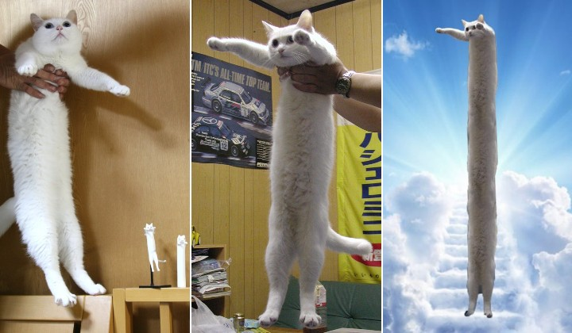

## 👏멀티캠퍼스 풀스택 수업

2022.07.04~~

### 1. 수업 필기

- 1일차 - [0705](https://github.com/rrwe23/TIL/blob/master/%EC%88%98%EC%97%85%20%ED%95%84%EA%B8%B0/0705.md)
- 2일차 - [0706](https://github.com/rrwe23/TIL/blob/master/%EC%88%98%EC%97%85%20%ED%95%84%EA%B8%B0/0706.md)
- 

### 2. 풀어본 예제

- 0705 - [Python](https://github.com/rrwe23/TIL/blob/master/%EC%98%88%EC%A0%9C/Python.md)

### 3.수업 자료

- 0705 ~06 [1일차마크다운](https://github.com/rrwe23/TIL/blob/master/%ED%92%80%EC%8A%A4%ED%83%9D%20%EC%88%98%EC%97%85%20%EC%9E%90%EB%A3%8C/1%EC%9D%BC%EC%B0%A8%EB%A7%88%ED%81%AC%EB%8B%A4%EC%9A%B4.pdf)

### 4.참고사이트

1. [Github](https://github.com/)

