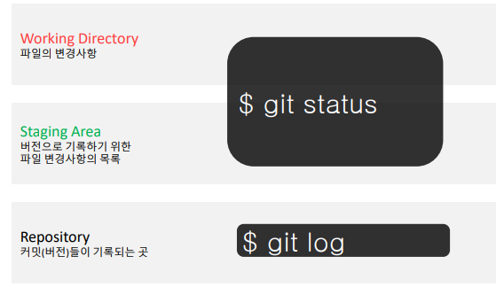
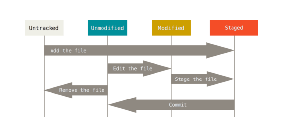
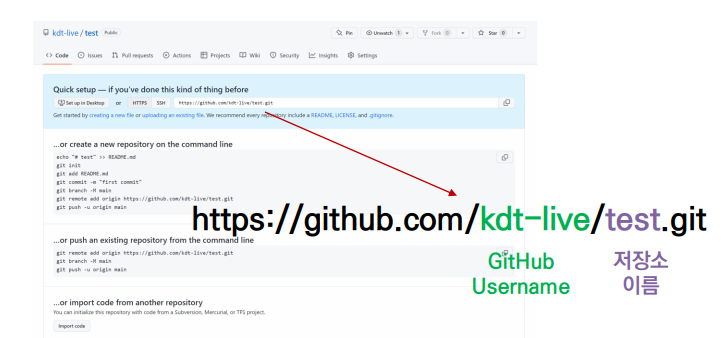

## Git

> 작업을 하고, 변동사항을 남겨 커밋한다
>
> 분산버전관리시스템

## Gitignore

명령을 통해 수정 거부?

> 목록에 적으면  git이 무시한다

 

## CLI(Command Line Interface)

> 가상 터미널 또는 텍스트 터미널을 통해 사용자와 컴퓨터가 상호 작용하는 방식

- GUI = 그래픽 기반의 인터페이스
- GLI = 명령 기반의 인터페이스

## 기본 명령어 

## 1. git add

> $ git add <file>
>
> working directory 상의 변경 내용을 staging area에 추가하기 위해 사용

- untracked 상태의 파일을 staged로 변경
- modified 상태의 파일을 staged로 변경

## 2. commit

> $ git commit -m '<커밋메세지>'

- staged 상태의 파일들을 커밋을 통해 버전으로 기록
- SHA-1 해시를 사용하여 40자 길이의 체크섬을 생성하고, 이를 통해 고유한 커밋을 표기
- 커밋 메세지는 변경 사항을 나타낼 수  있도록 명확하게 작성해야 함

> 다시 말해

## Git은 파일을 modified, staged, committed로 관리

- modified : 파일이 수정된 상태 ( add 명령어를 통하여 staging area로)
- staged : 수정한 파일을 곧 커밋할 것이라고 표시한 상태 (commit명령어로 저장소)
- committed: 커밋이 된 상태

> 상태를 알기 위해선?

## 기본 명령어 - log

- 현재 저장소에 기록된 커밋을 조회
- 다양한 옵션을 통해 로그를 조회할 수 있음

> $ git log -1       (가장 최근 로그 조회)
>
> $ git log --oneline      (한 줄로 표시)
>
> $ git log -2 --oneline     (가장 최근 2개 한줄로)

## 기본 명령어 - status

>  git status

- 파일의 상태를 알 수 있음
  - Untracked files
  - Changes not staged for commit
  - Changes to be committed
-  Noting to commit, Working tree clean

## 파일 라이프사이클

| 명령어                    | 내용                            |
| ------------------------- | ------------------------------- |
| git init                  | 로컬 저장소 생성                |
| git add <파일명>          | 특정 파일 /폴더의 변경사항 추가 |
| git commit -m '<message>' | 커밋(버전 기록)                 |
| git status                | 상태 확인                       |
| git log                   | 버전 확인                       |

## Github 에서 원격 저장소 만들기

1. New Repositiory
2. 저장소 설정하기
3. 확인하기

## 주소 해석

## 활용 명령어 - Push

> $ git push <원격저장소이름> <브랜치이름>

- 원격 저장소로 로컬 저장소 변경 사항(커밋)을 올림

  

