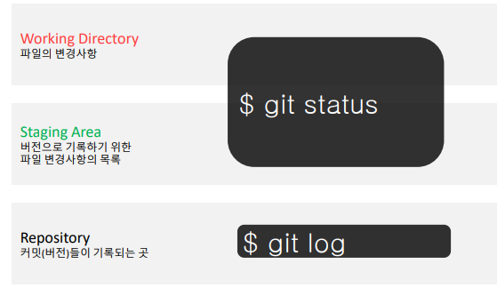
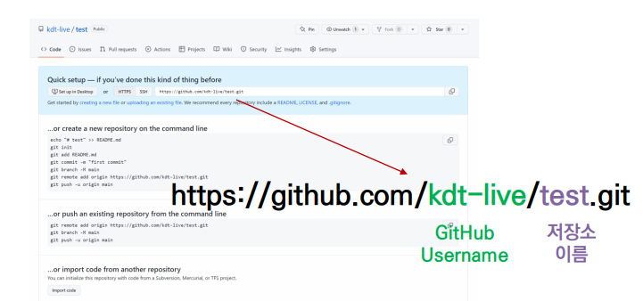

## Git

> 작업을 하고, 변동사항을 남겨 커밋한다
>
> 분산버전관리시스템


## Gitignore

> git 추적하지 않는 파일  관리

 명령을 통해 수정 거부?

## CLI(Command Line Interface)

> 가상 터미널 또는 텍스트 터미널을 통해 사용자와 컴퓨터가 상호 작용하는 방식


- GUI = 그래픽 기반의 인터페이스
- GLI = 명령 기반의 인터페이스


## 기본 명령어 


## 1. git add

> $ git add <file>
>
> working directory 상의 변경 내용을 staging area에 추가하기 위해 사용

- untracked 상태의 파일을 staged로 변경
- modified 상태의 파일을 staged로 변경

## 2. commit

> $ git commit -m '<커밋메세지>'

- staged 상태의 파일들을 커밋을 통해 버전으로 기록
- SHA-1 해시를 사용하여 40자 길이의 체크섬을 생성하고, 이를 통해 고유한 커밋을 표기
- 커밋 메세지는 변경 사항을 나타낼 수  있도록 명확하게 작성해야 함


> 다시 말해


## Git은 파일을 modified, staged, committed로 관리

- modified : 파일이 수정된 상태 ( add 명령어를 통하여 staging area로)
- staged : 수정한 파일을 곧 커밋할 것이라고 표시한 상태 (commit명령어로 저장소)
- committed: 커밋이 된 상태


> 상태를 알기 위해선?




## 기본 명령어 - log

- 현재 저장소에 기록된 커밋을 조회
- 다양한 옵션을 통해 로그를 조회할 수 있음

> $ git log -1       (가장 최근 로그 조회)
>
> $ git log --oneline      (한 줄로 표시)
>
> $ git log -2 --oneline     (가장 최근 2개 한줄로)


## 기본 명령어 - status

>  git status

- 파일의 상태를 알 수 있음
  - Untracked files
  - Changes not staged for commit
  - Changes to be committed
- Noting to commit, Working tree clean


## 파일 라이프사이클


| 명령어                           | 내용                            |
| -------------------------------- | ------------------------------- |
| git init                         | 로컬 저장소 생성                |
| git add <파일명>                 | 특정 파일 /폴더의 변경사항 추가 |
| git commit -m '<message>'        | 커밋(버전 기록)                 |
| git status                       | 상태 확인                       |
| git log                          | 버전 확인                       |
| git remote -v                    | 연결된 repository 확인          |
| git remote remove ~~             | 연결된 repository 삭제          |
| git remote add origin ~~(깃주소) | 깃주소로 repository 연결        |


## Github 에서 원격 저장소 만들기


1. New Repositiory
2. 저장소 설정하기
3. 확인하기




## 주소 해석


## 활용 명령어 - Push


> $ git push <원격저장소이름> <브랜치이름>

- 원격 저장소로 로컬 저장소 변경 사항(커밋)을 올림

  

# Git branch

## 1. branch 관련 명령어

> Git 브랜치를 위해 root-commit을 발생시키고 진행하세요.

```
$ git init
(master) $ touch README.md
(master) $ git add .
(master) $ git commit -m 'Init'
```

1. 브랜치 생성

   ```
   (master) $ git branch {브랜치명}
   ```

2. 브랜치 이동

   ```
   (master) $ git checkout {브랜치명}
   ```

3. 브랜치 생성 및 이동

   ```
   (master) $ git checkout -b {브랜치명}
   ```

4. 브랜치 삭제

   ```
   (master) $ git branch -d {브랜치명}
   ```

5. 브랜치 목록

   ```
   (master) $ git branch
   ```

6. 브랜치 병합

   ```
   (master) $ git merge {브랜치명}
   ```

   - master 브랜치에서 {브랜치명}을 병합

## 2. branch 병합 시나리오

> branch 관련된 명령어는 간단하다.
>
> 다양한 시나리오 속에서 어떤 상황인지 파악하고 자유롭게 활용할 수 있어야 한다.

### 상황 1. fast-foward

> fast-foward는 feature 브랜치 생성된 이후 master 브랜치에 변경 사항이 없는 상황

1. feature/home branch 생성 및 이동

   ```
   (master) $ git branch feature/home
   (master) $ git checkout feature/home
   ```

2. 작업 완료 후 commit

   ```
   (feature/home) $ touch home.txt
   (feature/home) $ git add .
   (feature/home) $ git commit -m 'Add home.txt'
   (feature/home) $ git log --oneline
   b534a34 (HEAD -> feature/home) Complete Home!!!!
   e89616a (master) Init
   ```

3. master 이동

   ```
   (feature/home) $ git checkout master
   (master) $ git log --oneline
   ```

4. master에 병합

   ```
   (master) $ git merge feature/home 
   Updating e89616a..b534a34
   Fast-forward
    home.txt | 0
    1 file changed, 0 insertions(+), 0 deletions(-)
    create mode 100644 home.txt
   ```

5. 결과 : fast-foward

   ```
   (master) $ git log --oneline
   b534a34 (HEAD -> master, feature/home) Complete Home!!!!
   e89616a Init
   ```

6. branch 삭제

   ```
   (master) $ git branch -d feature/home 
   Deleted branch feature/home (was b534a34).
   ```

------

### 상황 2. merge commit

> 서로 다른 이력(commit)을 병합(merge)하는 과정에서 **다른 파일이 수정**되어 있는 상황
>
> git이 auto merging을 진행하고, **commit이 발생된다.**

1. feature/about branch 생성 및 이동

   ```
   (master) $ git checkout -b feature/about
   (feature/about) $
   ```

2. 작업 완료 후 commit

   ```
   (feature/about) $ touch about.txt
   (feature/about) $ git add .
   (feature/about) $ git commit -m 'Add about.txt'
   (feature/about) $ git log --oneline
   5e1f6de (HEAD -> feature/about) 자기소개 페이지 완료!
   b534a34 (master) Complete Home!!!!
   e89616a Init
   ```

3. master 이동

   ```
   (feature/about) $ git checkout master
   (master) $
   ```

4. *master에 추가 commit 이 발생시키기!!*

   - **다른 파일을 수정 혹은 생성하세요!**

   ```
   (master) $ touch master.txt
   (master) $ git add .
   (master) $ git commit -m 'Add master.txt'
   (master) $ git log --oneline
   98c5528 (HEAD -> master) 마스터 작업....
   b534a34 Complete Home!!!!
   e89616a Init
   ```

5. master에 병합

   ```
   (master) $ git merge feature/about
   ```

6. 결과 -> 자동으로 *merge commit 발생*

7. 커밋 및 그래프 확인하기

   ```
   $ git log --oneline --graph
   *   582902d (HEAD -> master) Merge branch 'feature/about'
   |\
   | * 5e1f6de (feature/about) 자기소개 페이지 완료!
   * | 98c5528 마스터 작업....
   |/
   * b534a34 Complete Home!!!!
   * e89616a Init
   ```

8. branch 삭제

   ```
   $ git branch -d feature/about 
   Deleted branch feature/about (was 5e1f6de).
   ```

------

### 상황 3. merge commit 충돌

> 서로 다른 이력(commit)을 병합(merge)하는 과정에서 **같은 파일의 동일한 부분이 수정**되어 있는 상황
>
> git이 auto merging을 하지 못하고, 충돌 메시지가 뜬다.
>
> 해당 파일의 위치에 표준형식에 따라 표시 해준다.
>
> 원하는 형태의 코드로 직접 수정을 하고 직접 commit을 발생 시켜야 한다.

1. feature/test branch 생성 및 이동

   ```
   (master) $ git checkout -b feature/test
   ```

2. 작업 완료 후 commit

   ```
   # README.md 파일 열어서 수정
   (feature/test) $ touch test.txt
   (feature/test) $ git add .
   (feature/test) $ git commit -m 'Add test.txt'
   (feature/test) $ git log --oneline
   95fad1c (HEAD -> feature/test) README 수정하고 test 작성하고
   582902d (master) Merge branch 'feature/about'
   98c5528 마스터 작업....
   5e1f6de 자기소개 페이지 완료!
   b534a34 Complete Home!!!!
   e89616a Init
   ```

3. master 이동

   ```
   $ git checkout master
   ```

4. *master에 추가 commit 이 발생시키기!!*

   - **동일 파일을 수정 혹은 생성하세요!**

   ```
   # README.md 파일 열어서 수정
   (master) $ git add README.md
   (master) $ git commit -m 'Update README.md'
   ```

5. master에 병합

   ```
   (master) $ git merge feature/test 
   Auto-merging README.md
   CONFLICT (content): Merge conflict in README.md
   Automatic merge failed; fix conflicts and then commit the result.
   ```

6. 결과 -> *merge conflict발생*

   > git status 명령어로 충돌 파일을 확인할 수 있음.

   ```
   (master|MERGING) $ git status
   On branch master
   You have unmerged paths.
     (fix conflicts and run "git commit")        
     (use "git merge --abort" to abort the merge)
   
   Changes to be committed:
           new file:   test-1.txt
           new file:   test-2.txt
           new file:   test.txt
   
   Unmerged paths:
     (use "git add <file>..." to mark resolution)
           both modified:   README.md
   ```

7. 충돌 확인 및 해결

   ```
   <<<<<<< HEAD
   # 마스터에서 작업함...
   =======
   # 테스트에서 작성
   >>>>>>> feature/test
   ```

   => 나보고 고치라는 것인가 학생^^?

8. merge commit 진행

   ```
   (master|MERGING) $ git add .
   (master|MERGING) $ git commit
   ```

   - vim 편집기 화면이 나타납니다.
     - 자동으로 작성된 커밋 메시지를 확인하고, `esc`를 누른 후 `:wq`를 입력하여 저장 및 종료를 합니다.
     - `w` : write
     - `q` : quit
   - vs code 편집기에서 메시지보고 닫아주세요~!

9. 커밋 및 확인하기

   ```
   (master) $ git log --oneline --graph
   *   bc1c0cd (HEAD -> master) Merge branch 'feature/test'
   |\  
   | * 95fad1c (feature/test) README 수정하고 test 작성하고
   * | 2ecad28 리드미 수정
   |/  
   *   582902d Merge branch 'feature/about'
   |\  
   | * 5e1f6de 자기소개 페이지 완료!
   * | 98c5528 마스터 작업....
   |/  
   * b534a34 Complete Home!!!!
   * e89616a Init
   ```

10. branch 삭제

    ```
    (master) $ git branch -d feature/test
    ```


## GitHub push 오류 시 참고

> 분명 나는 푸시하고 잤는데 왜! 어제 잔디가 왜 안 심겼지? 하는 그런 슬픈 상황들! 지금부터 시작합니다. (기니까 관심없으신 분들은 패쓰해도 좋습니다) 혹시 그런 오류가 나시면 이 목록 참고하시면서 참고하시면 좋을 것 같습니다

1. 내 컴퓨터의 email과 name이 github의 그것과 일치하지 않는 경우 → 아마도 github에서는 해당 유저가 아닌 다른 유저가 push한 것으로 판단하고 잔디를 안 심어주는 것 같았습니다. 잔디를 심기 전에 내 컴퓨터의 email, name이 github의 것과 동일한지 확인해주세요! 
2. 내가 그 git repository를 삭제한 경우 → 카운팅을 git repository에 남겨진 commit을 기준으로 놓고 하는 것 같았습니다. 따라서 내가 여러 번 push를 했던 git repository를 삭제하면 commit이 다 날아감으로써 잔디에서도 카운팅이 사라지게 됩니다. 따라서 혹여나 안 쓰게 된 repository가 있더라도 웬만하면 삭제하지 마시고 남겨두시거나 혹은 나중에 다른 프로젝트를 할 때 이전 파일들을 다 지우고(통일성 측면에서 보면 권장되지는 않는 행위겠죠 ㅎㅎ) 새 프로젝트 파일로 채우시면 됩니다.
3.  github의 디폴트 branch로 push하지 않은 경우 → 여러분이 협업을 하거나 혼자서 협업 연습을 하게 되면 branch를 여러 개 사용하게 될 겁니다. 그리고 보통 최종본 모습을 메인이 되는 branch에 마지막에 push하게 되죠. 그런데 잔디 카운팅은 github에 메인으로 설정한 branch에 들어가는 커밋만 세게 됩니다. 주의하셔야 합니다. 10시간 코딩했는데 디폴트 branch에는 push할 것이 하나도 없었다면, 잔디에는 아무것도 안 보일 겁니다. 디폴트 branch로 merge를 진행하시거나 다른 repository에서 잔디를 심으시면 됩니다. 디폴트 branch로 merge된 횟수로(내가 다른 branch에 push한 수가 아니라) 카운팅이 됩니다. 
4. git repository가 비공개일 경우 → 잔디는 기본적으로 비공개 repository의 push는 카운팅하지 않습니다. 설정을 변경해주시거나(저는 변경해서 썼습니다) 혹은 최대한 공개 repository만 운용해야 잔디 카운팅이 정상적으로 진행됩니다.
5.  시간이 다른 경우 → 저는 다시 가고 싶은 나라의 시간으로 제 노트북 시간을 설정해 놓는데요, 그렇게 되면 push하는 시간이 제가 있는 한국 시간이 아니라 제 컴퓨터에 설정된 시간을 기준으로 push가 됩니다. 예를 들어 제가 한국 시간으로 자정까지 코딩을 열심히 하고 push도 자정이 넘어서까지 했다고 칩시다. 그럼 오늘과 내일 잔디를 일석이조로 해결했다 생각하고 다음날은 펑펑 놀 수도 있겠죠. 그런데 제 컴퓨터 시간은 그 당시 아직 날짜가 바뀌기 전이었다면 잔디는 제 예상과는 달리 하루에만 찍혀있게 됩니다. 흔한 경우는 아니지만 저는 자주 겪는 문제라 적어보았습니다. 6. forked한 repository에 push한 경우 → fork는 다른 사람의 git repository의 일부를 수정하거나 추가하고 싶을 때 쓰는 기능입니다. 아마 원제작자가 아니라서 잔디 카운팅이 안 되는 것으로 알고 있습니다.  혹여나 내용이 이해가 안 가더라도 천천히 잔디 쌓아가시다 보면 다 알게 되실 내용들입니다(초반에는 주로 1, 2, 4, 5에서 걸립니다). 잔디는 심으려고 노력하면서 꾸준히 공부하게 되는 것도 많고 뿌듯함도 느끼기 좋아서 다들 한 번 쯤 시도해보면 좋을 컨텐츠인 것 같습니다. 저는 추천드려요! 그럼 오늘도 수고 많으셨고, 꾸준히 해보자구요!


